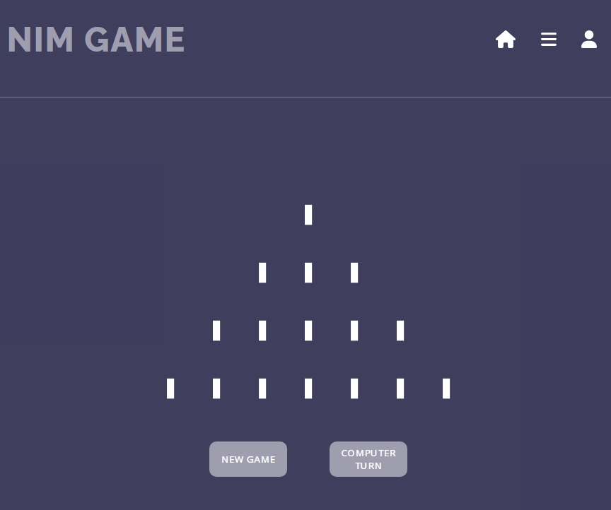

# Online Nim Game



## Description

Online Nim is a strategic game developed using React, styled components, and JavaScript. It seamlessly integrates with Firebase, providing real-time interactions, dynamic content updates, and a live ranking system to enhance player engagement and competition.

This project was created as the final project for the React Frontend Bootcamp at IT Academy, Barcelona in 2023.

**Rules of Marienbad Nim Game:**

- You may delete any number of sticks in each move, but at least one.
- You may delete sticks from one single line in each move.
- To win, leave the computer with the last stick.
- You can make the first move or let the computer start the game.

## Features

- Players compete against the computer.
- Logged-in users can save their scores in the player ranking.

## Demo

Visit our live demo to try the game: [Online Nim Demo](https://patobottos.github.io/playingnimgame/)

## Contributing

If you're interested in contributing to this project, please feel free to contact me at patobottos[at]gmail.com.

## License

```markdown
MIT License

Copyright (c) 2023 Patricio Bottos

Permission is hereby granted, free of charge, to any person obtaining a copy of this software and associated documentation files (the "Software"), to deal in the Software without restriction, including without limitation the rights to use, copy, modify, merge, publish, distribute, sublicense, and/or sell copies of the Software, and to permit persons to whom the Software is furnished to do so, subject to the following conditions:

The above copyright notice and this permission notice shall be included in all copies or substantial portions of the Software.

THE SOFTWARE IS PROVIDED "AS IS," WITHOUT WARRANTY OF ANY KIND, EXPRESS OR IMPLIED, INCLUDING BUT NOT LIMITED TO THE WARRANTIES OF MERCHANTABILITY, FITNESS FOR A PARTICULAR PURPOSE, AND NONINFRINGEMENT. IN NO EVENT SHALL THE AUTHORS OR COPYRIGHT HOLDERS BE LIABLE FOR ANY CLAIM, DAMAGES, OR OTHER LIABILITY, WHETHER IN AN ACTION OF CONTRACT, TORT, OR OTHERWISE, ARISING FROM, OUT OF, OR IN CONNECTION WITH THE SOFTWARE OR THE USE OR OTHER DEALINGS IN THE SOFTWARE.
```

## Credits

- **Student**: Patricio Bottos
- **Mentor**: Pablo Monteserín
- **Stick Design**: Marta González
- **Place and Date**: Barcelona, July 2023

## Contact Information

- Pato Bottos
- Email: patobottos[at]gmail.com

## Acknowledgments

I would like to acknowledge the following for their support and contributions to this project:

- IT Academy and Pablo Monteserín for their guidance.
- Marta González for her creative stick designs.
- My family for their unwavering support and encouragement.

Enjoy playing Nim!
